# PocketDJ — Product Storybook

**PocketDJ** is an offline-first PWA that "puts a DJ in your pocket": it turns a
personal music collection (here, a digitized **vinyl** crate of 1,361 albums /
12,525 songs) into something you can *explore* and *perform from* on a phone —
even with no signal. Every album and song is enriched with metadata, mood
keywords, and **audio analysis** (BPM, musical key, and Camelot-wheel code), and
all cover art is cached locally so the app is fully usable offline and durable
across restarts.

**The user story.** *As a DJ / crate-digger, I want to browse my whole collection
on my phone — by genre, by tempo, or by harmonic key — find the right record
fast, see each track's BPM/key so I can beat- and key-match, drill into a single
album, and fix up any wrong metadata, all without a network connection.* PocketDJ
serves that story with two complementary lenses on the same data: a visual,
**spatial "star map"** for discovery and a precise, **filterable browser** for
look-up — joined by a per-album **solar-system** view and **single-album** track
table for the close-up work.

The screens below follow a natural journey: **discover** (star map → solar
system), **look up** (browser → single album), then **maintain** (edit modals,
settings). All shots are from the real local app at mobile width (402×874) unless
labeled *desktop*.

---

## 1. Star map — genre mode (mobile grid)

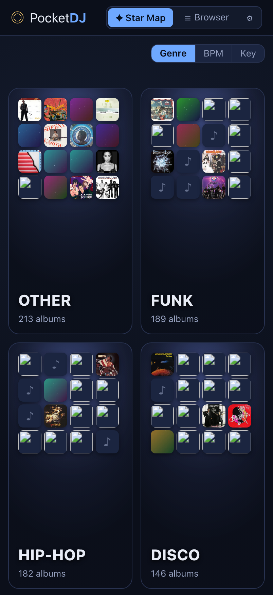

The landing screen. On a phone the star map renders as a vertically-scrolling
**2-column grid of constellation cards** (the pan/zoom SVG night-sky is illegible
on a phone, so the grid replaces it). Each genre card is a big **TITLE**, an
album **count**, and a **4×4 mosaic of ~16 randomly-sampled covers** from that
genre, so you recognize the constellation at a glance.

**Affordances**
- **Genre / BPM / Key** segmented toggle (top right) — switches how the whole
  collection is grouped. Genre is selected here.
- **⚙ gear** (far top right) — opens the Settings popout.
- **✦ Star Map / ☰ Browser** pills (top bar) — switch between the two main views.
- **A constellation card** — tap to *drill into* that genre's sub-genres (see §2).
- The grid free-scrolls to the rest of the genres below the fold.

**User story:** this is the **discovery** entry point — "show me my crate, grouped
the way a DJ thinks about it." Genre is the default mental model; the cover mosaic
makes each pile instantly recognizable.

---

## 2. Star map — drilled into a genre (sub-genres)

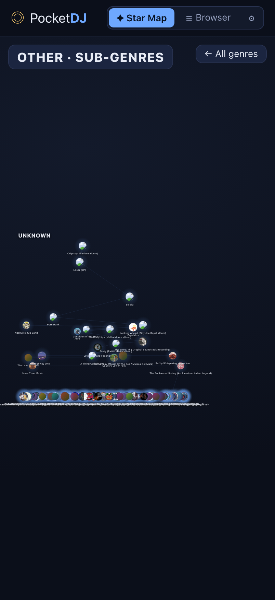

Tapping a genre card drills in. The mode toggle **hides**, a breadcrumb
(**"OTHER · SUB-GENRES"**) appears, and a **"← All genres"** back button takes you
up a level. Inside the focused genre, albums are drawn as **clickable stars** in a
constellation scatter (each art-backed star shows a small cover and its album-name
caption); tapping a star opens that album's **solar system** (§4).

**Affordances**
- **← All genres** — return to the genre grid (§1).
- **A star** — open `/map/:albumId`, the album's solar system.

**User story:** narrows discovery from "a genre" down to "the actual records in
it," keeping the spatial, browse-by-feel experience while getting you one tap from
any single album.

---

## 3. Star map — BPM mode

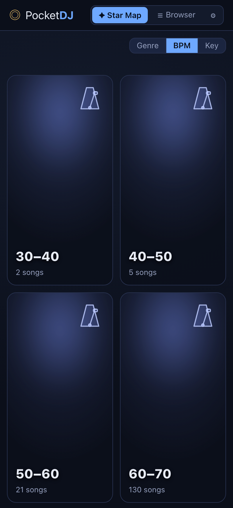

The same collection, regrouped by **tempo**. Each card is a **BPM range** (30–40,
40–50, 50–60, 60–70 …) marked with a **metronome glyph** and the number of songs
in that band.

**Affordances**
- **BPM** is selected in the mode toggle.
- **A BPM card** — opens the browser pre-filtered to songs in that tempo band.

**User story:** direct support for **beat-matching** — "what have I got around 120
BPM?" is the core question when building a set, and this is the one-tap answer.

---

## 4. Star map — Key mode (Camelot colors)

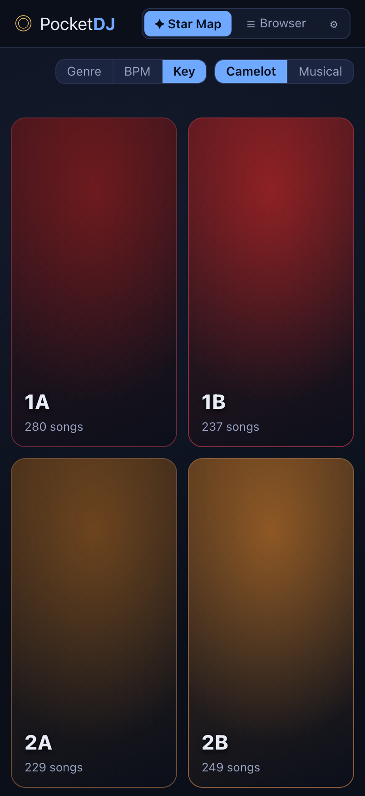

Regrouped by **musical key**, with each card **tinted by the Camelot color** of its
key. The 12 wheel numbers map to 12 hues around the color circle; **B (major)**
reads brighter, **A (minor)** deeper — so 1A/1B are red, 2A/2B amber, and so on
around the wheel. An **"Unknown"** card (songs with no analyzed key) stays a
neutral grey.

**Affordances**
- **Key** is selected; a **Camelot / Musical** sub-toggle switches the key
  *notation* shown on the cards (Camelot codes like `8A` vs. musical names like
  `A minor`).
- **A key card** — opens the browser pre-filtered to songs in that key.

**User story:** **harmonic mixing** — the Camelot wheel is exactly the tool DJs use
to pick key-compatible tracks, and coloring the cards by it makes adjacent
(mixable) keys visually obvious.

---

## 5. Settings popout

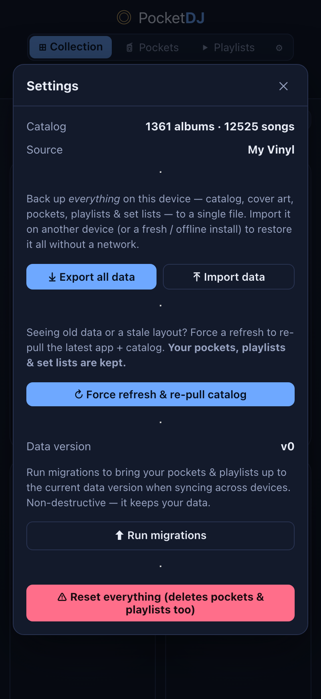

Opened from the **⚙ gear**. Shows the catalog size (albums · songs) and the active
source, plus a single maintenance action.

**Affordances**
- **↻ Force refresh & re-pull catalog** — clears this device's cached app shell +
  data and re-pulls the latest catalog from the server (the fix for "I'm seeing
  old data or a stale layout"). The button shows "Refreshing…" while it works.

**User story:** the offline cache is a feature, but occasionally you *want* the
newest catalog — this is the escape hatch that re-syncs without reinstalling.

---

## 6. Solar system view (`/map/:id`)

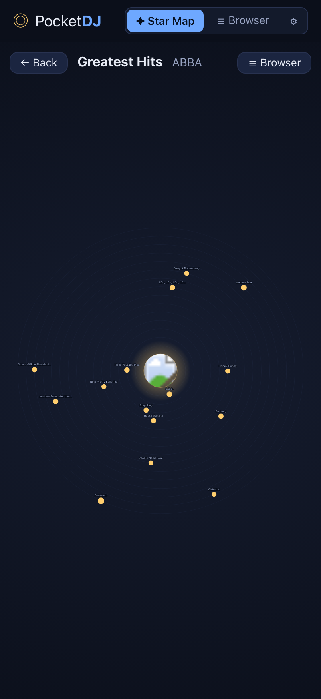

A single album rendered as a **solar system**: the **album cover is the sun** at the
center and each **song is a planet** orbiting it. Planet *size* scales with track
length; planet *color* flags content (explicit tracks read red, tracks with mood
keywords use the secondary accent). Each planet is captioned with its song name.

**Affordances**
- **← Back** — return to the star map (or wherever you came from).
- **☰ Browser** — jump to this album's single-album track table (§8).
- **Tap the sun (cover)** — open the album **audio-tracks popup** (§7).
- **Tap a planet** — open that song's read-only detail card (like §9).

**User story:** a playful, at-a-glance close-up of one record — see its shape (how
many tracks, how long, how spicy) before committing, and pivot straight into the
precise views.

---

## 7. Solar system — audio-tracks popup

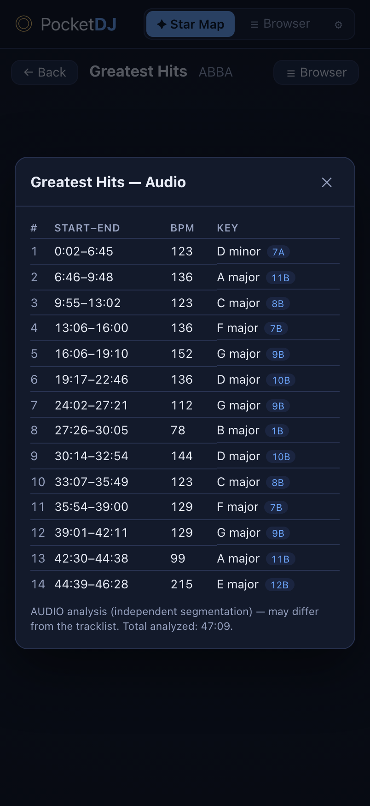

Tapping the sun opens **"<album> — Audio"**: the album's **independent audio
segmentation** in a table of **# · Start–End · BPM · Key** (each key shown with its
Camelot tag, e.g. `7A`). The caption notes that this segmentation is detected from
the recording and *may differ from the metadata tracklist*, with the total
analyzed runtime.

**User story:** the ground-truth tempo/key data a DJ actually mixes on, surfaced
right where you're looking at the record. (The same table appears, editable, in §8
and §15.)

---

## 8. Single-album view (`/album/:id`)

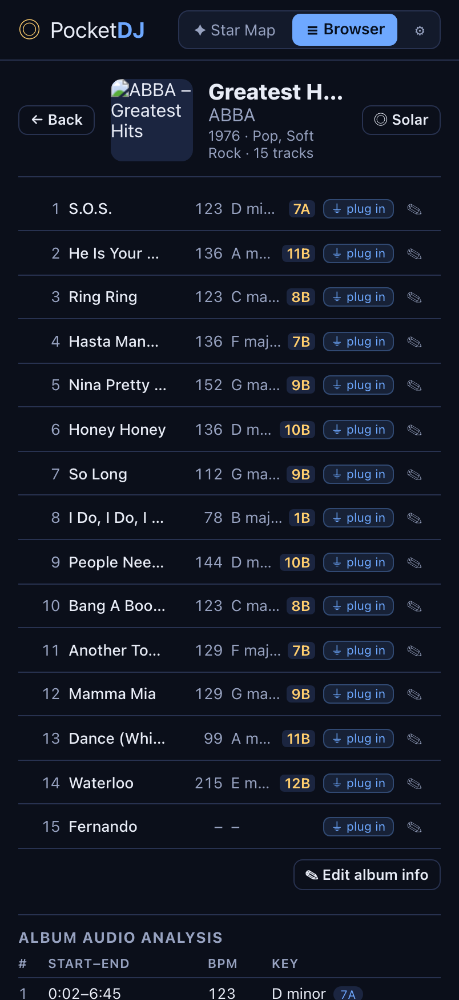

The precise per-album work surface: a **header** (cover, title, artist,
year · genre · track count) over a **track table**. Each row shows the track number,
title, **BPM**, **key**, and **Camelot** tag, plus a "plug in" affordance for the
physical/file pointer. A **"ALBUM AUDIO ANALYSIS"** footer repeats the
audio-segmentation table from §7.

**Affordances**
- **← Back** — returns to the browser **with your filters/sort preserved**.
- **◎ Solar** — open this album's solar system (§6).
- **A track row** — open that song's detail card (§9).
- **✎ Edit album info** — open the album editor (§14).
- **✎ Edit audio analysis** (in the footer) — open the audio editor (§15).

**User story:** the "I've found the record, now show me everything about it"
view — every track's mixable data in one scannable table, with edit hooks for
fixing anything wrong.

---

## 9. Song detail modal

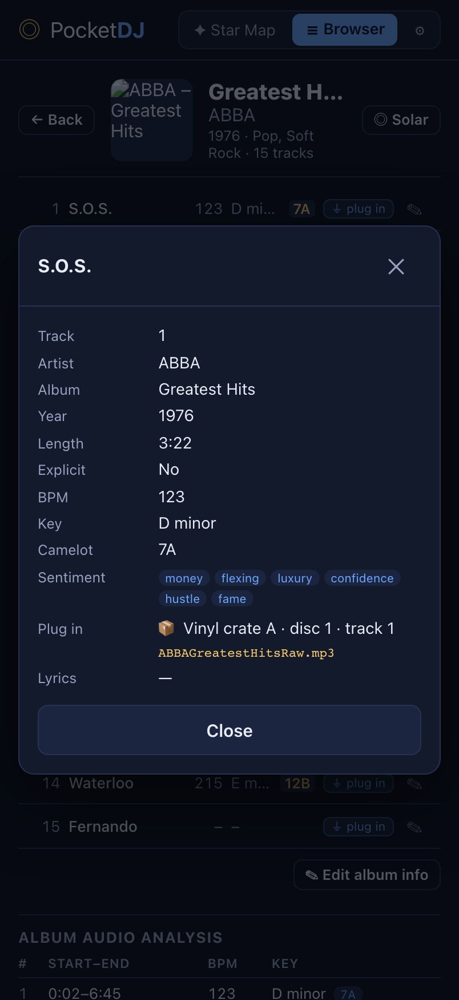

Tapping a track row (here, or a planet in §6) opens a **read-only** song card:
track #, artist, album, year, length, explicit flag, **BPM / Key / Camelot**
(or "— pending audio" when not yet analyzed), sentiment keyword tags, the physical
"plug in" pointer, and lyrics when found.

**Affordances**
- **✕ / Close** — dismiss (Escape or backdrop-tap also close).

**User story:** the full single-track read-out for when you need every detail of
one song without leaving the album.

---

## 10. Browser — albums (mobile)

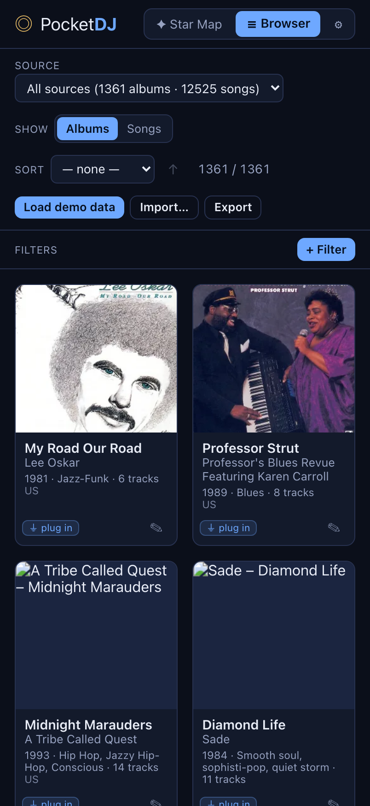

The look-up lens. A **responsive grid of album cards** (cover, title, artist,
year · genre · track count). Cards lazy-load their cached covers. Tapping a card
opens the single-album view (§8); each card has a **✎** edit shortcut.

**Affordances** (toolbar, fuller view in §12)
- **Source** selector, **Albums / Songs** type toggle, **Sort**, result count, and
  the import/export bar.
- **⚙** settings, **✦ Star Map / ☰ Browser** view switch (top bar).

**User story:** "I know roughly what I want — let me filter and sort to it,"
complementary to the spatial star map.

---

## 11. Browser — songs (mobile)

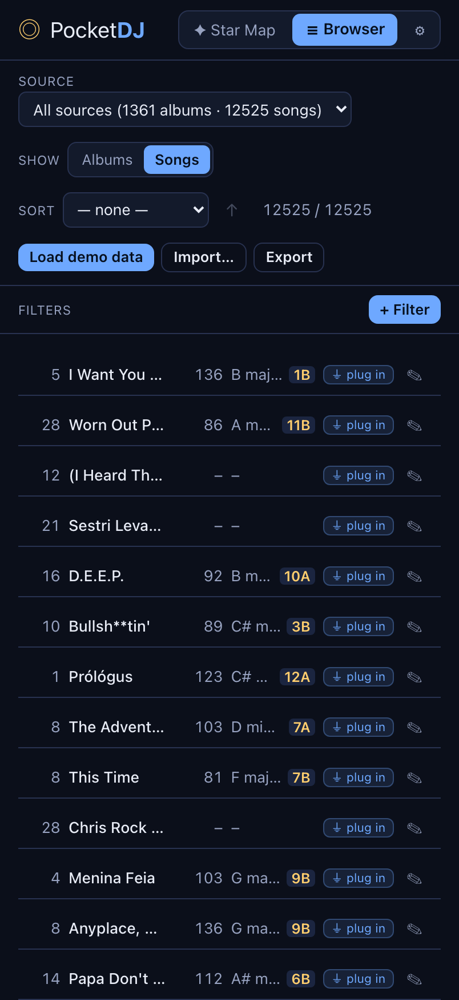

Flipping the type toggle to **Songs** swaps the album grid for a **dense song
list**. Each row is track # · title · **BPM** · **key** · **Camelot** tag · "plug
in" · **✎**. The result count (here `12525 / 12525`) updates as you filter.

**Affordances**
- **Albums / Songs** toggle (Songs active).
- A **row** opens the song detail card (§9); **✎** opens the song editor (§16).

**User story:** the track-level look-up — scan, filter, and sort 12k songs by the
exact fields that matter for mixing.

---

## 12. Browser — filter & sort (desktop)

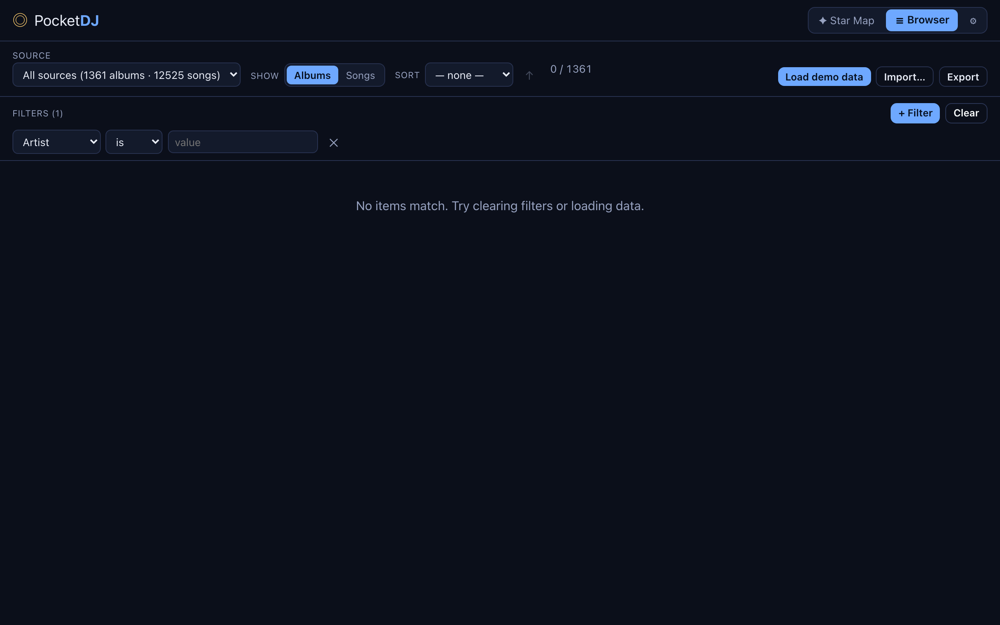

The full toolbar, shown at desktop width. The **filter builder** composes
AND-clauses of *field · operator · value* (e.g. *Genre is Disco*, *BPM between
120–128*); operators include is / is-not / in-list / between, with field-aware
value editors. **Sort** picks a field + direction (↑/↓). The **import/export bar**
loads demo data, imports a `.json`/`.zip`, or exports the whole catalog as a `.zip`
for portability.

**Affordances**
- **+ Filter** — add a clause; **Clear** removes all; each row has **✕** to remove.
- **Sort** field dropdown + **↑/↓** direction.
- **Load demo data / Import… / Export**.

**User story:** the power-user query surface — express the exact crate slice you
want and carry your library between devices.

> **Interchange formats — `.pocketdj.zip` & friends.** *Import…* accepts any of the
> PocketDJ zip kinds and routes on the manifest: a **full backup** (`.pocketdj.zip` —
> catalog + collections + your metadata edits), a single **playlist**
> (`.playlist.pocketdj.zip`), or a single **pocket** (`.pocket.pocketdj.zip`). These
> are the *same* files the native iPhone/iPad/Mac apps read and write, so a backup made
> on your phone imports straight into the browser (and vice-versa). A native backup
> omits the catalog (both apps re-seed the same index) but carries an `edits.json` of
> your corrections; importing it **merges those edits** into the PWA — so a BPM/key/name
> fix made on the phone shows up in the browser. User-authored data (pockets, playlists,
> set lists, edits) round-trips losslessly both ways; the bundled catalog stays a
> browser↔browser concern. *Export* writes a portable backup that any client can read.

---

## 13. Browser — albums (desktop)

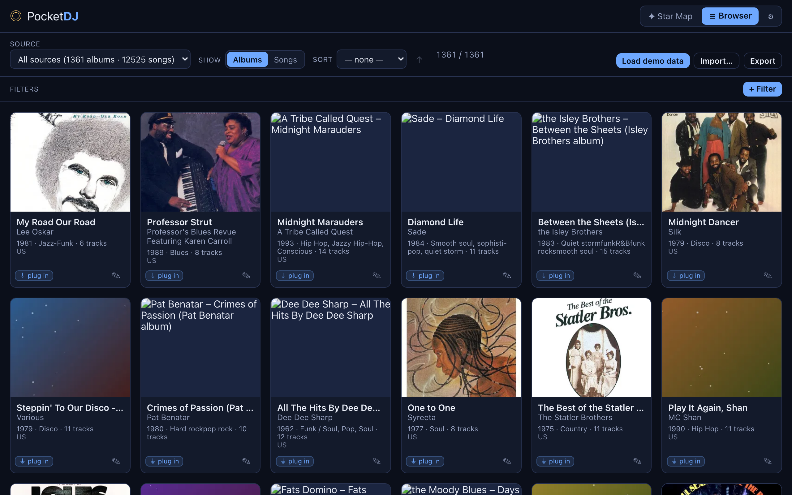

The same album browser at desktop width: a wider multi-column grid showing many
covers at once, for fast visual scanning on a laptop.

---

## 14. Edit album modal

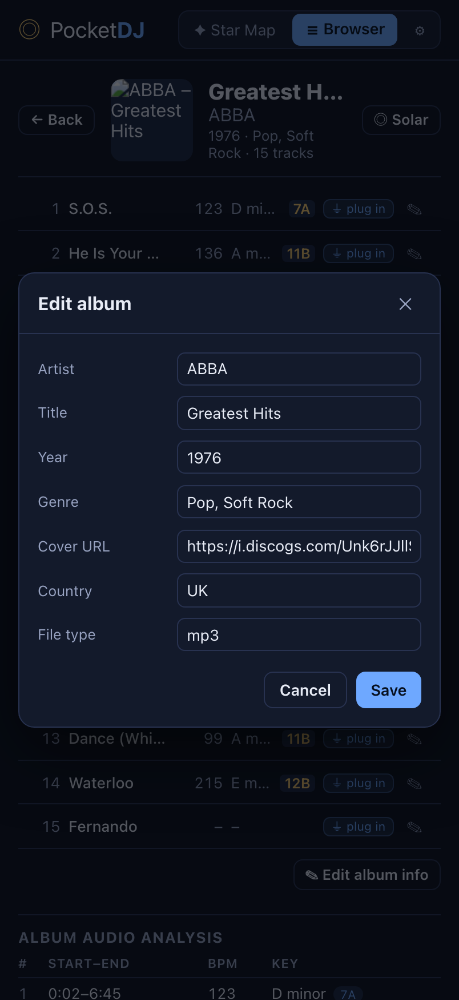

Opened from **✎ Edit album info** (§8) or a card's **✎**. Edits the album's
metadata: **Artist, Title, Year**, a **Genre** combo (suggests the canonical
category names *and* accepts free text), a **Cover URL** field (paste a new cover
to re-fetch), **Country**, and **File type**.

**Affordances**
- **Cancel** / **Save** (Save persists to the local IndexedDB catalog).

**User story:** fix wrong enrichment in place — bad genre, missing year, or a
broken cover — without re-running the indexer.

---

## 15. Edit audio-analysis modal

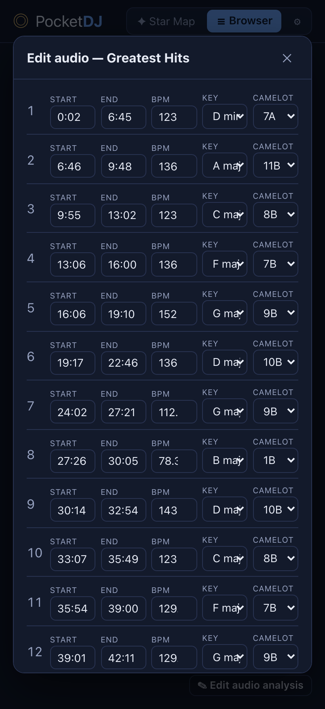

Opened from **✎ Edit audio analysis** in the album footer (§8). One editable row
per detected audio segment: **Start / End** (m:ss), **BPM**, **Key**, and
**Camelot**. The **Key** and **Camelot** dropdowns are linked — picking one fills
the other from the Camelot↔key mapping — so the pair always stays consistent.

**Affordances**
- **Cancel** / **Save**.

**User story:** correct the auto-detected tempo/key when the analyzer got a track
wrong — critical, because the whole BPM/Key discovery flow trusts these numbers.

---

## 16. Edit song modal

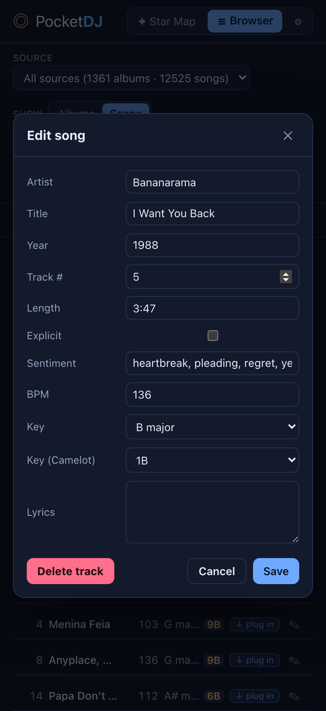

The song editor (opened from a song row's **✎**). Edits **Artist, Title, Track #,
Year, Length, Explicit**, **sentiment keywords**, and the audio fields — with
**Key** and **Camelot** as **valid-value dropdowns** (the 24 musical keys / 24
Camelot codes, kept in sync). It also exposes a destructive **Delete track**
action (§17).

**Affordances**
- **Cancel** / **Save**, and **Delete track** (red).

**User story:** per-song corrections — fix a mistagged key, mark a track explicit,
or remove a track that doesn't belong.

---

## 17. Delete-track confirm

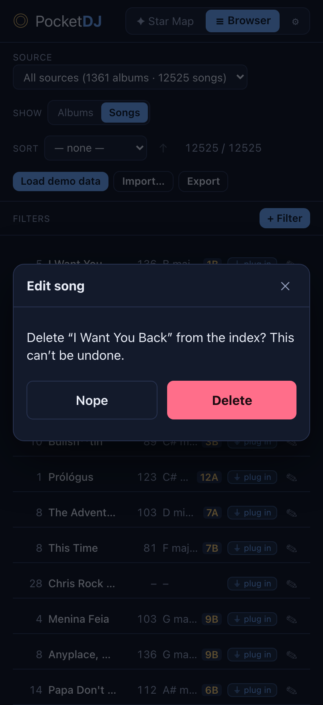

**Delete track** swaps the editor for a mobile-friendly confirm: *"Delete '<song>'
from the index? This can't be undone."* with a safe **Nope** and a red **Delete**.

**Affordances**
- **Nope** — back out (no change).
- **Delete** — remove the track from the local catalog.

**User story:** a deliberate two-step guard so a destructive edit can't happen by a
stray tap — important on a touch screen.

---

# Part II — Pockets, Playlists & Setlists (perform from the crate)

The screens above are about *exploring and maintaining* the collection. This part
is about **performing from it**. Three nouns:

- A **Pocket** is a reusable, harmonically-coherent grouping of songs/albums (and
  it can nest other pockets — a DAG). Think "Classic Soul Anthems."
- A **Playlist** is a **template**: an ordered set of **Sequences** ("chapters"),
  where each sequence holds songs, albums, or pocket references and can carry a
  **time budget**.
- A **Setlist** is a **frozen instance** produced by hitting **▶ Play**: PocketDJ
  *realizes* the template into a concrete, ordered track list — expanding albums,
  **sampling** over-budget pockets to fit the slot, and **autofilling** temporal
  gaps with harmonic bridge tracks — then persists it so you can hand it to the DJ:
  *"spin these tracks, in this order."*

The top bar also changes here: Star Map and Browser are merged into one
**Collection** mode (with a remembered **Map / List** sub-toggle), sitting beside
the new **Pockets** and **Playlists** modes. On a phone the brand stacks above the
mode tabs so nothing competes for width (visible in every shot below).

---

## 18. Pockets — list

The Pockets mode landing screen: a **New pocket** creator and a list of existing
pockets, each a card with a **kind badge** (`HARMONIC`), the name, and member
counts (*songs · albums · child pockets*).

**Affordances**
- **New pocket name… + Create** — make a pocket, then jump into it.
- **A pocket card** — open its detail (§19).
- The new **bag** icon marks the Pockets tab; the **▶ play** icon marks Playlists.

**User story:** "keep a few reusable crates of records that mix well together, so I
can drop a whole vibe into any set."

---

## 19. Pocket — detail

Inside a pocket: an editable **name**, an **⤓ Export**, a **Delete**, and the
**Members** list. **Export** writes a portable `.pocket.pocketdj.zip` (the pocket plus
any nested child pockets, DAG-expanded) that any client — browser or the native apps —
can import; ids are reminted on import so it never clobbers an existing pocket. Each
song is a **two-line row** — title + artist on top, then its **BPM** and
**Camelot key** badges (e.g. `57 BPM · 9A`) so the harmonic coherence of the pocket
is visible at a glance. A **Child pockets** section nests other pockets (cycle-
guarded). Tapping a song opens the same **song detail** popover used everywhere
else (§24).

**Affordances**
- **⤓ Export** — download the pocket (with its nested pockets) as a `.pocket.pocketdj.zip`.
- **Tap a song** — open its detail popover.
- **Remove** — drop a member.
- **Add child pocket** — nest another pocket (rejected if it would create a cycle).
- Members are added from anywhere via **＋ Add to…** (§20).

**User story:** curate the crate and *see the key/tempo spread* while you do it — a
pocket is only as good as how well its records mix.

---

## 20. Add to a pocket or playlist

The shared **＋ Add to…** picker, reachable from any song or album — the browser
song detail, the album view, and the solar-system popovers. It lists your
**Playlists** (with a sequence count) and **Pockets**, plus **＋ New playlist /
＋ New pocket** to create-and-add in one step. (Here it's layered over a song's
detail card — note *Lyrics — Not found* behind it, the lazy lyrics loader behaving
correctly when none exist.)

**Affordances**
- **A playlist row** — add the item (to a chosen sequence if it has more than one).
- **A pocket row** — add the item to that pocket.
- **＋ New playlist / ＋ New pocket** — create and add in one action.

**User story:** wherever you find a record, you're one tap from filing it into a set
or a crate.

---

## 21. Playlists — list

The Playlists mode landing: a **New playlist** creator and the list of playlist
**templates**, each showing its sequence and item counts.

**Affordances**
- **New playlist name… + Create** — start a template and open it.
- **A playlist card** — open its detail/editor (§22).

**User story:** "keep the sets I perform — Family BBQ, Sunday Brunch — as living
templates I can re-roll any time."

---

## 22. Playlist — the template (sequences)

The template editor. The header has the editable **name**, the primary **▶ Play**
button, and **Delete**. Below are the **Sequences** (chapters): here *Warm-up
(pocket)* carries a **10:00 target** and holds the **Soul Anthems** pocket (10
items); *Closers (songs)* holds two hand-picked songs. Each item can be **moved**
between sequences or **removed**, and **＋ Add sequence** adds a chapter. At the
bottom, **Set lists** is the history of everything you've generated from this
template.

**Affordances**
- **▶ Play** — realize the template into a new Setlist (§23) and open it.
- **target (m:ss)** — give a sequence a time budget; pockets sample to fit it.
- **Move to / Remove / ＋ Add pocket / ＋ Add sequence** — shape the chapters.
- **A set list row** — open a previously generated performance.

**User story:** compose the *shape* of the night — a warm-up pulled from a pocket,
a fixed pair of closers — without nailing down the exact tracks yet.

---

## 23. Setlist — a generated performance (the ▶ Play payoff)

Hitting **▶ Play** freezes a **Setlist**: *"Family BBQ — take 2 · 18:08 total."*
Tracks are grouped under **section headers that map to the playlist's sequences**.
The *Warm-up (pocket)* section came in at **9:50 — under its 10:00 budget**: from a
44-minute, 10-song pocket the engine **sampled** a coherent subset and **autofilled
harmonic bridges** (the `↔ bridge` tracks, key-matched at `10B`) to smooth the
transitions; the *Closers* are the `explicit` hand-picks. Every row shows **BPM +
Camelot key**, a **provenance badge** (`pocket` / `↔ bridge` / `explicit`), and a
dormant **Mix suggestions** seam (coming soon). **Play again → a different take**
(the pocket samples fresh each time).

**Affordances**
- **⤓ Save CSV** — export the set via the native OS file picker (name + location).
  Columns: `#, Artist, Title, BPM, Key, Length, Source, Sequence, Song ID` — the
  **Song ID** lets a downstream process resolve each track's audio segment in O(1).
- **Delete** — discard this take.
- **Tap a track** — open its song detail (§24).

**User story:** the mission payoff — a real, saved set list you can read off ("spin
these, in this order"), export, or regenerate for a different feel.

---

## 24. Setlist — tap a track for song detail

Tapping any setlist track (or pocket member, or browser row) opens the shared
read-only **song detail** popover — track #, artist, album, genre, year, length,
explicit flag, **BPM / Key / Camelot**, sentiment tags, the analog **plug-in**
pointer, and lyrics — closed by a **mobile-friendly ✕** in the top-right.

**Affordances**
- **✕ (top-right) / Close / Escape / backdrop** — dismiss.
- **＋ Add to…** — file this track into a pocket or playlist (§20).

**User story:** one consistent detail card everywhere, so you can always check a
track's key/tempo before you commit it to a mix.

---

## 25. Collection — Map / List (the merged top-level mode)

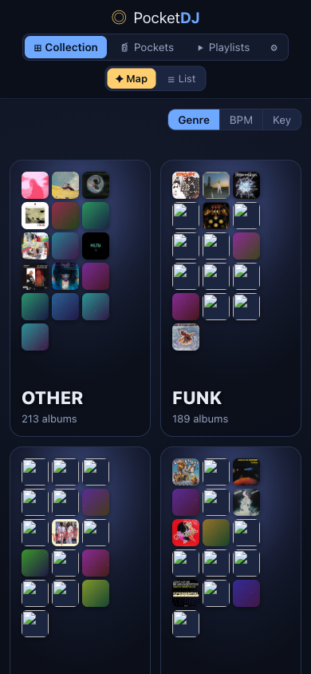

Star Map and Browser are now one **Collection** mode. A contextual **✦ Map / ☰
List** sub-toggle (under the main tabs) flips between the spatial star map and the
filterable list, and **remembers your choice** — clicking **Collection** later, or
relaunching the app, lands you back on the view you last used.

**Affordances**
- **⊞ Collection** — go to your remembered sub-view.
- **✦ Map / ☰ List** — switch sub-view (persisted).
- **🛍 Pockets / ▶ Playlists / ⚙** — the other modes + settings.

**User story:** "discovery and look-up are two takes on the same crate — keep them
together under one roof, and remember how I like to look at it."

---

## 26. Playlists & performance — 2026 update (what's new)

The playlist/pocket/setlist surfaces got a big pass. The shots in §5, §9, §11, §20,
§21, §22 and §23 above were **re-captured** for this update; the capabilities are
summarized here.

### Playlist template — enriched, reorderable items

Each item row now carries its **album cover art** and **BPM / Camelot** badges, and
the header shows a **song count + total runtime** both **per chapter** and for the
**whole playlist**. Every item has:

- **▲ / ▼ reorder** — move it up/down within its chapter (mobile-friendly tap
  targets; disabled at the ends). The **→ chapter** dropdown still moves it *between*
  chapters.
- **＋ note** — an inline **performer note** (e.g. *"open cold — let it breathe"*).
- Tapping the **name** opens the full **song metadata** modal.

You can also drop a **free-text cue** that isn't a catalog item — *"sample of This
Land Is Mine Land"* — straight into a chapter (the **CUE** row). And **⤓ Export**
saves the playlist to a portable file (see below).

### Setlist — editable, with notes & cues

The realized set list (▶ Play) now has an **editable name**, **per-track performer
notes**, and renders any **free-text cues** as no-audio rows. The **Save CSV** export
gains a **Note** column, so your cues + notes travel to whatever you spin from.

### Song metadata — cover art + jump to the album

The shared song-detail card (used everywhere a song is tapped — browser, album
table, playlist, set list — **except** the solar view, which *is* the album art)
now shows the **album cover** and an **Album → ↗** link that opens the album view in
a new tab.

### "Add to…" remembers your last choice

The Add-to picker surfaces your **last-used** playlist/pocket first (with a *last
used* badge) and defaults the sequence to the one you last added into — fewer taps
when you're building a set fast.

### Song list — hide songs you've already placed

A **"Hide added"** multi-select dropdown filters the song list. Hide songs already
in **any playlist/pocket** (show only *unplaced* songs), or scope to a **checked
subset** of collections. A checkbox dropdown (not chips) so it scales to many
playlists/pockets and stays mobile-friendly. Full data **Import/Export moved to
Settings**, so the browser toolbar no longer duplicates it.

### Settings — backup/restore, safe refresh, migrations

- **⤓ Export all data / ⤒ Import data** — back up *everything* (catalog, art,
  pockets, playlists, set lists) to one file and restore it on another device or a
  fresh/offline install. Side by side.
- **↻ Force refresh** now **preserves your pockets, playlists & set lists** — it
  re-pulls only the catalog, so updating the app no longer wipes client-side work.
- **Data version + ⬆ Run migrations** — a versioned, non-destructive migration
  framework (baseline **v0**) that keeps collections compatible across app updates.
- **⚠ Reset everything** — a separate, clearly-labeled nuclear wipe (collections
  included), behind a confirm.

### Export / import a single playlist

A playlist exports to a tiny **`.playlist.pocketdj.zip`** that **references the
catalog by id** (the app re-seeds the same index), so it's ~4 KB instead of bundling
hundreds of KB of catalog + art — yet imports with every song resolved. A
`portable` mode still bundles everything for a device with a different/empty catalog.
Import lands it as *"… (imported)"* without clobbering existing playlists.

---

## 27. Multi-source, collection filters & online search — 2026 update

PocketDJ is no longer vinyl-only: it indexes **multiple data sources** into one
catalog, adds a **show/hide** pair of collection filters to the song list, and gains
an optional **online search** mode backed by OpenSearch. The browser shots in
§8–§11 now show two sources.

### A second source — Apple Music (Local)

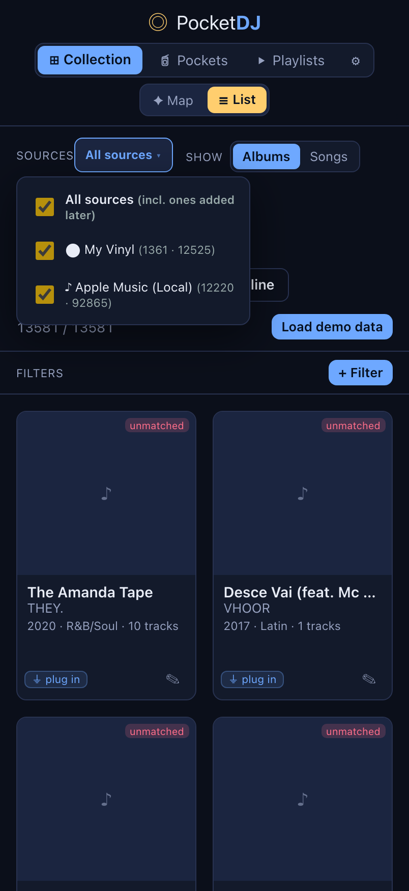

Alongside the digitized vinyl crate, the app can index your **Apple Music library**
(from the macOS `Library.xml`) as a second, **digital** source — here **12,220
albums / 92,865 songs** next to vinyl's **1,361 / 12,525**. The **Sources** picker is
a multi-select: show **all**, **none**, or a **subset** (e.g. just vinyl, or just
Apple Music). Digital albums carry real genre/year/track metadata but no cover art
(the ♪ tile) — art is added only via a rip/burn. The selection **persists**, and the
star map, counts and browser all respect it. Items are kept distinct per source, so
the same album owned on vinyl *and* in Apple Music never collide.

### Settings ▸ Sources — load / remove sources

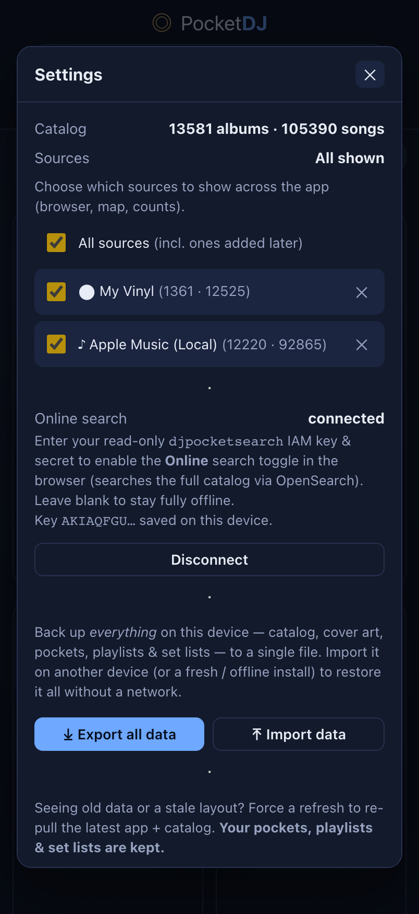

Apple Music is **opt-in**: a fresh device boots vinyl-only (fast), and you add the
library with **＋ Load Apple Music (Local)** in Settings ▸ Sources. The same
multi-select lives here too, plus a per-source **✕ remove** (which also drops that
source's imported playlists). Importing the library also **mirrors your iTunes
playlists** into app playlists. (This shot also shows the **Online search** panel —
see below.)

### Show *and* hide — collection filters on the song list

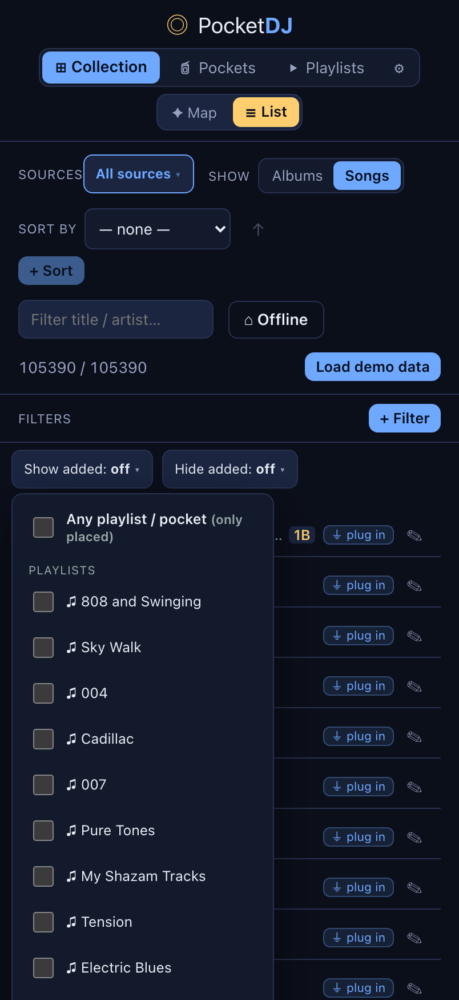

The song list now has a **pair** of membership filters. **Hide added** (from §26)
drops songs already placed; the new **Show added** keeps **only** songs that *are* in
a chosen playlist/pocket (or *any*). Both can be on at once — the browser
**intersects** them (e.g. "everything in *Peak Hour* that isn't already in *Saturday
Set*"). The dropdowns list your playlists + pockets, including the **imported iTunes**
ones.

### Online search (OpenSearch) — opt-in ⚡

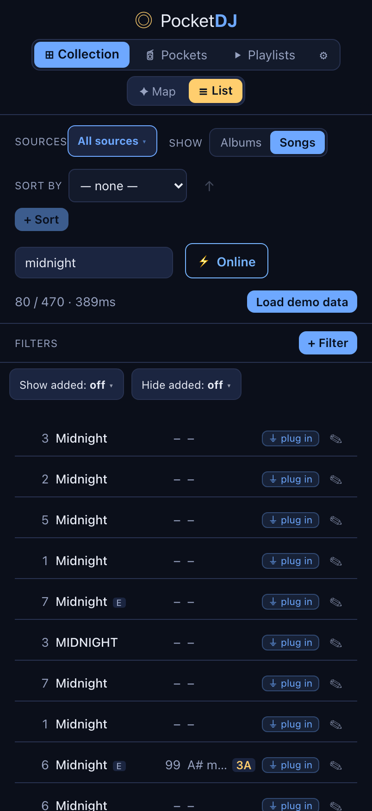

A search box spans the catalog. **Offline** (the default) it filters the loaded set
by title/artist locally. Once you paste a **read-only search key/secret** into
**Settings ▸ Online search** (§28), an **⚡ Online** toggle appears: it queries
**OpenSearch Serverless** across **title, artist, album, lyrics and sentiment** over
the *entire* indexed catalog — here **80 of 470** matches for *"midnight"* in
**389 ms**, with explicit (**E**) and BPM/key badges intact. The browser signs each
request itself (SigV4) and reaches the collection same-origin via a CloudFront proxy,
so there's no separate server to run and the collection scales to **$0 when idle**.

---

## 28. Stream & download — rip on demand (2026 update)

The offline-first crate is now **playable end to end**. Any song or album can be
**streamed or downloaded** from a ▶/⤓ button: on a cache miss the app asks the iMac
(over Tailscale) to **rip** the track — analog from a local recording, Apple Music in
real time via Audio Hijack — upload an **mp3** to a public S3 cache, then stream it
back. Rip once → instant forever (and playable anywhere, since the cache is just S3).

### ▶ / ⤓ on every song & album + a mini player

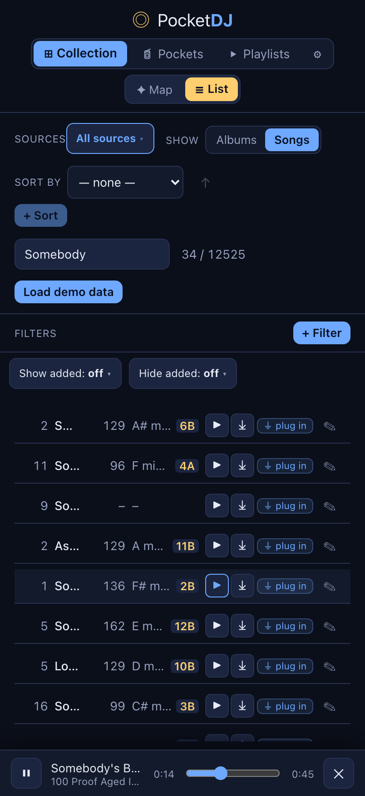

Each song row and album card gets **▶ Play** and **⤓ Download**. Tap ▶ and — if it
isn't already ripped — the button shows the live phase **Searching… → Ripping mm:ss →
Uploading…** (polled from the rip server), then a **mini player** docks at the bottom
with **⏮/⏭** and **auto-seek** to the track inside a whole-album rip. Already-ripped
songs play instantly.

**Audio analysis + waveform scrub.** Every ripped song is analyzed in the background:
**BPM, musical key & Camelot** are computed (librosa) and **rolled into the default
index** — so they're filterable, sortable, on the star map, and in song detail, just
like the rest of the catalog (existing audio-stage values are kept; only gaps are
filled). A **waveform** image is generated (ffmpeg) and uploaded alongside the rip;
the player lazy-loads it (like cover art / lyrics) and renders it as a **clickable
scrub bar** — click anywhere on the waveform to seek. The same analysis runs on songs
ripped via the **`rip` skill** (a setlist's `_ripped/` folder) through the batch tool.

### Play while it rips — live streaming

Tapping ▶ on an un-ripped Apple Music song now **plays within a few seconds and
follows the real-time capture**, instead of waiting the full capture + upload. As
Audio Hijack records, the server segments the growing audio into a **live HLS** stream
(`tail | ffmpeg`, 2 s AAC segments + a rolling playlist) and serves it over Tailscale;
the player shows a red **● LIVE** chip. HLS is used because iOS Safari plays it
natively (a plain progressive stream is silent on iOS); desktop browsers without
native HLS use a lazy-loaded `hls.js`. When the rip finishes it uploads the durable
mp3 to S3 as before, so every later play is the **seekable** cached file (with the
waveform). Analog stays rip-then-play (already faster than real time).

The app and rip server do a small **version handshake** (`/health`): if the server is
reachable but **outdated** (e.g. its process predates a code update), the app shows a
transient banner — *"Rip server is outdated — restart it for live streaming"* — that
auto-dismisses after 5 s, instead of silently failing to stream.

### Settings ▸ Rip server

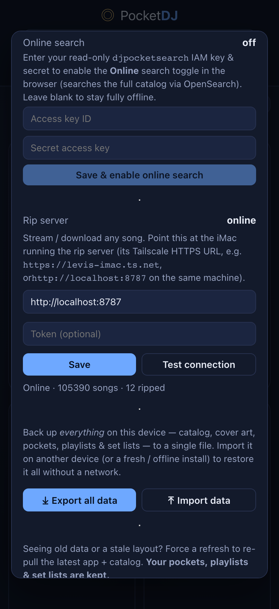

Point the app at the **iMac running the rip server** — its Tailscale HTTPS URL
(`https://…ts.net`) from your phone, or `http://localhost:8787` on the same machine —
and **Test connection**. The rips live in a public S3 cache (deterministic
`rips/<id>.mp3`), so the server is only needed to *create* a rip; once ripped, a song
plays from anywhere even with the server off.

### Setlist ▸ Rip all · Play all · Burn

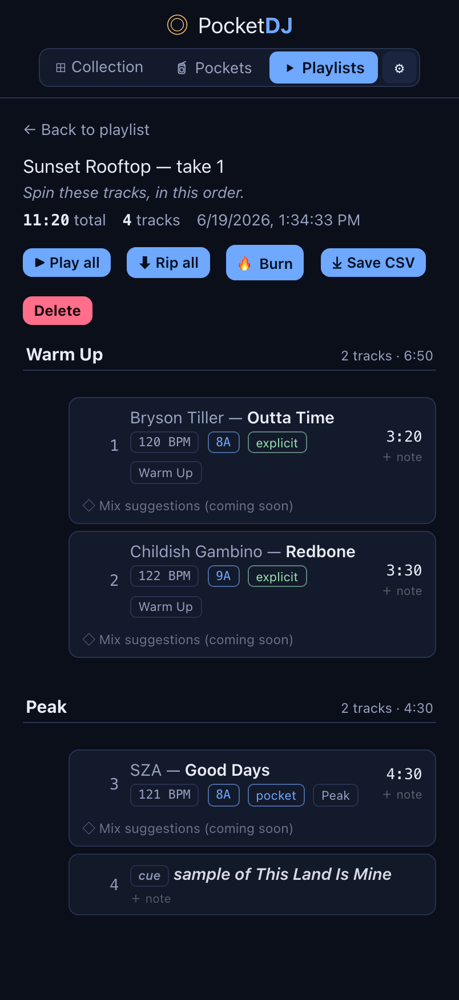

A realized set list gains three actions: **⬇ Rip all** (rip every track so playback is
instant), **▶ Play all** (play the set start→finish, **ripping ahead** so the next
track is ready before the current ends, auto-advancing the mini player), and **🔥 Burn**
(rip any that aren't yet, then download the whole set as one **zip**). Progress shows
as *Ripping / Burning N/M*.

---

# Part III — The native app: play, identify & stream (2026 update)

Everything above is the cross-client product. This part is what the **native
iPhone / iPad / Mac app** (under `apple/`) adds on top of the same crate: an
**inline player** that plays and downloads right inside the list, a **"?♪?"** button
that *listens* and identifies the song in the room, a Settings section to **link a
streaming subscription** (Apple Music · Spotify · YouTube) beside your own catalog,
and full **keyboard navigation** for the desktop. The shots/copy below describe the
native surfaces; they read the *same* catalog, rips cache, and collections as the PWA.

> Some streaming sources are **scaffolded, not yet live**: the app ships and runs
> with none configured. Apple Music is wired on and ready to enable; Spotify and
> YouTube need a developer to drop in an SDK + credentials first (see the setup
> guide [`streaming-integration.md`](./streaming-integration.md)). Each unconfigured
> account simply reads **"Not available."**

---

## 29. The inline player — play, stream, download, scrub

Every song row in the native app — in the Browser **and** in an album's track table —
has a **▶ play** and **⤓ download** button on the right (the `RowTransport`). They're
the same rip-on-demand transport the PWA mini-player uses, but the player itself docks
**inline, directly below the row you played**.

**Play.** Tap **▶**. **Apple Music (Local) songs now stream straight from Apple
Music** — when the app can find the track in the Apple Music catalog (and you've
linked Apple Music in Settings, §31), tapping ▶ plays it instantly from your
subscription via MusicKit, no ripping involved (the player shows a *"via Apple
Music"* backend). Only when there's no catalog match (an obscure pressing, a
region-gated or removed track) does it **degrade to ripping** — so a song *always*
plays, but the common case is now an immediate Apple Music stream instead of a
multi-minute capture. If the song is already ripped it plays instantly from the cache;
otherwise the button shows the live rip phase — **Queued… → Searching… → Ripping mm:ss →
● Streaming live → Uploading…** (polled from the rip server) — and, for an un-ripped
track that fell back to ripping, begins playing the **live HLS** stream within seconds
while the capture continues (a red **● live** chip). When the row is the one playing,
**▶ flips to a pause/resume toggle** for that same player instead of re-resolving.

**The slide-out panel.** Below the playing row a panel appears with:
- a **play/pause** button, the **title · artist**, a **chevron** to collapse/expand,
  and an **✕** to close (stop + dismiss),
- a full-width **waveform** image (lazy-loaded, like cover art) sitting **edge-to-edge**
  above a full-width **scrubber** — drag the slider to seek; elapsed / duration labels
  flank its two ends,
- for a live stream, instead of a scrubber: a *"Streaming live as it rips"* state (a
  live HLS stream has no fixed length to scrub).

The position updates ~4×/s smoothly without the buttons ever going "dead" — a subtle
but real win the desktop build needed (the scrubber redraws on its own clock so it
never disturbs the control buttons' taps).

**Download.** Tap **⤓** to resolve the durable mp3 — ripping it on demand first if it
isn't ripped yet (the button shows the same live rip phase: *Searching… / Ripping
mm:ss / Uploading…*) — then a native **save-location picker** opens so you choose
*where* the file lands (the **NSSavePanel** on macOS, the document picker in export
mode on iOS/iPadOS), pre-filled with an `Artist - Title.mp3` name. The OS writes the
mp3 to the spot you pick; cancel or an error just resets the button.

**Lock screen & Control Center.** Native playback registers with the OS, so the
current track shows on the **lock screen / Control Center** with working play / pause /
scrub (AirPods and CarPlay drive it too); audio keeps playing in the background.

**User story:** "I found the record — now let me actually hear it, right here, without
leaving the list — and scrub to the drop."

---

## 30. "?♪?" — identify the song that's playing

At the **top of the Browser**, centered, is a **"?♪?"** button — two question marks
flanking a music note. Tap it and the app **listens through the mic** (ShazamKit),
**identifies** the playing song, and maps it back to your crate:

- while listening it pulses with a sonar ring (note bounces; *Identifying* as it
  queries),
- a hit **in your crate** opens a *"Heard it"* sheet — **"In your crate"** with an
  **Open song** deep-link straight into that song's detail,
- a hit **not in your crate** shows the recognized title/artist/artwork as **"Not in
  your crate"**, and — when Shazam returns an Apple Music id — notes *"A linked Apple
  Music account can play this."*,
- if mic permission is **denied**, the button shakes, shows a `mic.slash`, and tapping
  it jumps to Settings.

Matching is title+artist **normalized** (so *"Café (Remastered 2011)"* still matches
*"Cafe"*). On a build without ShazamKit it simply reads *"Recognition isn't available
in this build."* — never a crash.

**User story:** "Something great is playing — what is it, and have I already got it?"
One tap answers both.

---

## 31. Settings ▸ Streaming accounts — link Apple Music, Spotify, YouTube

A new **"Streaming accounts"** section in native Settings sits beside your URL
**Data sources**. It lists one row per provider — **Apple Music**, **Spotify**,
**YouTube** — each with a status line and a **Log in / Log out** button:

- a configured provider shows **Log in**; linking hands off to that service's sign-in
  (Apple Music shows the system consent sheet; Spotify/YouTube run an OAuth redirect
  back into the app), after which the row reads **Linked / Connected**, and **Log out**
  severs it,
- an **unconfigured** provider (no SDK/credentials in this build) reads **"Not
  available"** with a developer note,
- the section footer explains: *link a streaming service to play directly from your
  subscription, beside your own catalog sources;* Spotify needs the Spotify app
  installed and a **Premium** account for on-demand playback.

A linked subscription is an **additional, account-based source** — orthogonal to the
vinyl / Apple Music (Local) URL catalogs and to rip-on-demand. It also gives the "?♪?"
recognizer a way to **play** a recognized track that isn't in your crate.

**User story:** "Beyond my own crate, let me reach into my streaming subscription —
log in once, and play from it inside the same app."

---

## 32. Keyboard navigation (desktop)

On the Mac (and an iPad keyboard), the Browser is fully **keyboard-drivable**:

- **↑ / ↓** move a **focus cursor** that highlights a row — across the **song list**
  *and* the **album grid/list** (the album grid walks album order linearly). It works
  **live during search**: type a query, then arrow into the results.
- **⌘P** plays (or pauses/resumes) the **focused song**.
- **Return** or **⌘O** **opens** the focused item — an album → its detail, a song →
  its song detail — the same destination a click reaches.

Other shortcuts round it out: **⌘1 / ⌘2** Albums / Songs, **⌘L** focus search,
**⌘V** grid/list, **⌥⌘F** Filter, **⌥⌘S** Sort.

**User story:** "On a laptop I want to fly — Spotlight-style: type, arrow down,
hit Return to open or ⌘P to play, hands never leaving the keyboard."

---

## 33. Rip & Burn a whole set — take it offline

Playing one song at a time is great in the room with signal. But a gig is a *set*, and
the venue might have no signal at all. So every collection you can perform from — a
**playlist**, a **pocket**, a **setlist**, or a whole **source** ("From your sources")
— gets two collection-level buttons in its detail screen: **Rip** and **Burn**.

**Rip = "send the whole set to be recorded."** Tap **Rip** and the app hands the entire
set to your iMac to capture — analog tracks from your vinyl recordings, Apple Music
tracks in real time — and upload each as an mp3 to the shared cache. Nothing downloads to
your phone; this is just *"make sure every track in this set exists as a rip."* Because
ripping Apple Music happens in real time and one track at a time, it **completes over
time** in the background — so the result reads like *"Ripped 8 of 10 — 2 unrippable,
enqueued, completes over time,"* with a **Refresh** to reconcile the final counts later.
Re-tapping Rip on a set that's mostly done is cheap: already-ripped and in-progress tracks
are skipped. (Rip is only offered when you've pointed the app at a rip server.)

> **You usually don't even have to ask.** Whenever you simply *play* an Apple Music track
> in the app, it quietly gets ripped in the background too (no waiting, no prompt) — so a
> set you've been playing through is often already half-ripped before you ever tap **Rip**.

**Burn = "download this set for offline."** Tap **Burn** and the app downloads every
*already-ripped* track in the set onto the device, so the whole set plays with **no
signal and no rip server**. Burn never waits on a live recording — it only pulls tracks
that are already ripped, and reports the rest as *"not yet ripped — Rip first"* (so the
natural flow is **Rip**, let it finish, then **Burn**). Alongside each downloaded track it
writes a plain-text companion with the track's **BPM, key (musical + Camelot), sentiment,
album, and full metadata** — the same kind of mixer-ready sidecar the desktop burn
produces. Burning the same set again is smart: it re-downloads only what's **missing or
stale** (e.g. a track you re-ripped, or whose BPM/key was re-analyzed since), and skips
everything still current. Progress shows as *"Burning 6 of 10,"* ending in a summary like
*"Burned 6 of 10 — 4 not yet ripped."*

**Where you'll see them.** The pair appears on the playlist detail, the pocket detail, the
setlist detail, and the read-only "From your sources" list — anywhere you've gathered a set
worth carrying. Both buttons disable when the collection has nothing rippable in it.

**⏹ Stop — cancel a rip or burn in flight.** While a Rip or Burn is running, a red **Stop**
control stays reachable. Tap it and the in-flight job halts: a **Stop rip** tells the iMac
to drop this set's still-queued and currently-recording tracks; a **Stop burn** ends the
download loop after the current file (so whatever already finished stays on the device). Either
way you get the partial summary so far — handy when you change your mind about a long set
mid-capture, or only meant to grab the first few tracks.

**Live "X of N ripped" — and a Stop that stays put.** A collection **Rip** captures every
track in real time, one at a time, so it finishes *over minutes or hours* on the iMac long
after the app has handed off the set. The app now follows that progress: a small **"ripping —
3 of 12 done"** chip ticks up as each track lands in the cache, sitting beside a persistent red
**Stop** the whole time the rip is running — not just for the split-second it takes to send the
set off. (Earlier, Stop flashed by in about a second and was effectively unusable for a long
rip.) When the last track completes, the chip resolves to **"Ripped 12 of 12"**; tap **Stop**
at any point to drop whatever's still queued or recording and keep what already finished.
Rips also **self-heal** server-side — a stuck capture or a briefly-unplugged vinyl drive no
longer freezes the queue, so a long Rip reliably grinds to completion (it just keeps going,
retrying transient hiccups) instead of stalling forever.

**User story:** "I've built the set — now make it bulletproof: rip everything so it's
captured, then burn it onto my phone so it plays in a basement with no bars, every track
carrying the BPM and key I mix on — and let me call it off if I started the wrong one."

---

## 34. Settings ▸ Rip from cloud · burnt-music folder

Two new native Settings controls refine *how* and *where* the app rips and burns.

**Rip from cloud source.** In **Settings ▸ Rip server**, below the URL, a **Rip from cloud
source** toggle changes where a rip comes from. With it **on**, any song that *exactly* matches
a track in your iMac's Apple Music library is captured from **Apple Music itself** (real-time,
one track at a time) instead of from a vinyl recording — so even a set built from the vinyl
crate can be ripped at full digital quality when the same recording lives in your library. When
there's no exact match it **falls back to the vinyl rip** automatically, so nothing is skipped.
The match is deliberately strict: a *remix*, *radio edit*, *live*, or *instrumental* version
won't masquerade as the standard recording (and vice-versa) — only the genuinely-same recording
matches, so a cloud rip never quietly swaps in the wrong version. The setting's footer warns that
because cloud rips capture in real time, one at a time, a large **Rip/Burn can take a while**.

**Burnt-music folder.** A new **Burnt music** section lets you pick **where burned audio +
their `.txt` sidecars are saved**. By default they live in the app's private storage; tap
**Choose burnt-music folder…** and pick any folder (the system folder picker on each platform)
to have burns land somewhere **you can browse yourself** — in **Finder** on the Mac or **the
Files app** on iPhone/iPad. The chosen folder's name is shown with a **Use app storage** button
to revert. Now the mixer-ready files (audio + BPM/key/sentiment sidecar) are right where you can
drag them into a DJ app or back them up.

**User story:** "Rip from my actual Apple Music library when it's the same record — and drop
the burned files in a folder I can open, not buried inside the app."

---

## 35. Setlist ▸ ▶ Play — play the whole set in order

A realized set list gains a **▶ Play** button in its toolbar (beside Rip/Burn). Tap it and the
app plays the set **start to finish, in order**, in the inline player — auto-advancing to the
next track as each one ends. For each track it prefers the **burned local file** if you've
burned the set (so it plays with no signal), otherwise it **streams** the rip; a track that
can't be played at all (no rip, no server) is **skipped** rather than stalling the set. The
button flips to **⏹ Stop** while it runs (and reorder/delete are locked so the queue can't
shift under playback). When the current track is a **live** stream — which has no natural end —
a **⏭ Next** button appears so you can advance by hand.

**User story:** "Hit one button and let the set play itself through, in order — the way I'll
actually run it on the night — pulling from what I've burned and skipping anything not ready."

---

## 36. Browse — genre & collection-membership filters, per-clause remove

The native Browser's **Filter** sheet gains the PWA's richer filtering (and a little more).

**Genre filter.** Add a **Genre** clause and pick from a multi-select of **top-level
categories** — the ~15 buckets the star map groups by (Disco, Soul, House…), not the ~600 raw
sub-genres. Two operators: **in list** (any-of — keep songs/albums in any of the picked
categories) and **not in list** (none-of — drop them). It works in both Albums and Songs mode
(a song inherits its album's category). **Genre** is also a **Sort** key, so you can order the
list by category.

**Collection-membership filters (Songs mode).** When you've got playlists or pockets, a
**Collection membership** section adds two filters: **In playlist / pocket** keeps **only** songs
that *are* in a chosen collection (or *any*), and **Not in playlist / pocket** **drops** songs
that are. Each is an *"Any playlist / pocket"* toggle plus per-collection checkboxes, with its
own **Clear**. Both can be on at once — the list shows the **intersection** (e.g. *everything
in Peak Hour that isn't already in Saturday Set*) — exactly mirroring the web app, including
your **imported iTunes** playlists.

**Per-clause remove.** Every filter clause now has its **own remove** — a **trash** button (and
a left **swipe**) on the row — alongside the existing **Clear All**. So you can drop a single
clause without tearing down the whole query.

**User story:** "Filter by the genre buckets I think in, slice by what's already in my sets,
and peel off one filter at a time instead of starting over."

---

## 37. Online search — load-more pagination & server-side sort

The native **⚡ Online** search (OpenSearch) gets two refinements over the offline filter.

**Pagination — scroll to load more.** Instead of stopping at a fixed cap, online results now
**page in as you scroll**: the first page loads on a query/filter change, and reaching the
bottom of the list **fetches and appends** the next page, until every match is loaded. The
results header shows the **real total** (e.g. *"470 songs"*) — the full match count across the
entire indexed catalog, not just the rows currently on screen — so you always know how big the
result set actually is.

**Sort applies online too.** The Browser's **Sort** (field + ↑/↓) now drives the **online**
search as well: OpenSearch sorts the *whole* result set server-side and pages come back already
in order — so sorting by BPM, key, genre, year, or title behaves the same whether you're
searching offline or online, across the entire catalog rather than just the loaded slice.

**User story:** "Search the whole library online, scroll to pull in as many matches as I want,
see the true total, and sort it the way I always do."

---

## 38. Keep going in the background — rips, burns, downloads & playback don't stop when you leave

Capturing a whole set or burning it for offline takes real time — minutes for a long Rip,
a steady download-by-download grind for a Burn. Before, leaving the app (switching to
Messages, locking the phone, letting the screen sleep) could pause or drop that work
half-finished. Now the native app keeps the long jobs **alive in the background** so you can
start something big, pocket the phone, and come back to it done.

**Rips, burns & downloads continue while the app is backgrounded or locked.** Kick off a
collection **Rip** or **Burn**, or a single-track **⤓ Download**, then switch away or lock the
device — the work keeps running. Downloads and burns hand off to the system so each file
finishes (and the next one starts) even while the app is suspended; a **Burn** that was halfway
through when you locked the phone keeps landing tracks, and you'll find the set fully burned when
you return — its **"Burning 6 of 10"** progress having carried on the whole time. Even a **cold**
relaunch (the system having fully unloaded the app mid-transfer) picks the finished files back up
rather than losing them.

**Setlist playback plays on past the lock screen.** Hit **▶ Play** on a setlist (§35), lock the
phone or switch apps, and the set keeps playing — **auto-advancing from track to track** on its
own. The currently-playing song shows on the **lock screen / Control Center** (and on AirPods,
CarPlay, or a watch) with working **play / pause / next / previous** — so you can run the set, or
skip ahead, without ever unlocking. This is the whole set sequencing in the background, not just
a single track: each track ends, the next begins, hands-free.

**User story:** "Start a big rip or burn, lock my phone, and trust it'll be finished when I pull
it back out — and once a set is playing, run the whole thing from the lock screen, skipping tracks
from my headphones, without the music ever cutting out because I left the app."

---

## 39. Press Play on a playlist or pocket — hear it now, in order or shuffled

A playlist and a pocket aren't just things you *shape* — now you can **hear them straight away**.
Each playlist and pocket detail screen carries two side-by-side buttons:

- **▶ Play** — play its songs **in their listed order**, top to bottom,
- **🔀 Shuffle** — play the same songs in a **random order**.

Tap either and the app jumps you to a single reusable **"Now Playing"** set and **starts playing
at once** in the inline player, auto-advancing track to track. It's built **literally from the
songs you're looking at** — the exact list, in order (or shuffled) — not the "realized" set the
**make-a-set-list** button produces (§40): no sampling, no harmonic autofill, no dedup. A song
that can't be resolved to anything playable is simply dropped from the run. Because it's **one
shared set** that's **reused** every time, hitting **▶ Play** or **🔀 Shuffle** anywhere just
**replaces** what's in Now Playing rather than piling up a new set each time — and it's **hidden
from your set-list history** and **cleared on launch**, so it never clutters the sets you've
deliberately saved.

Landing in **Now Playing** drops you into the normal setlist screen (§35), so you can **see
what's next and reorder it on the fly** while it plays — exactly the controls you'd want with a
set running.

**User story:** "I just want to *hear* this crate right now — one tap to play it in order, one
to shuffle it — and still see and nudge what's coming up next."

---

## 40. The "make a set list" button — freeze a take from a playlist

The **older** ▶ Play behavior — *realize* a playlist into a frozen, saved take (expanding albums,
sampling over-budget pockets to fit, autofilling harmonic bridges; §22–§23) — now lives on its
own toolbar button marked with the **list.bullet.clipboard** icon. Tap it to generate a concrete,
persisted **set list** from the template, just as before; the plain **▶ Play** beside it is now
the play-it-now button from §39.

**User story:** "Keep the two ideas separate: one button just plays the crate, the other builds
me a real, saved set list I can tweak, rip, and burn."

---

## 41. Your playlists on top; folders to organize them

**Your playlists come first.** The Playlists screen now renders **your own playlists above** the
**"From your sources"** section — the sets you build are what you reach for, so they sit at the
top.

**Folders.** You can now group playlists into **folders**:

- **＋ New folder** — create one and name it,
- **rename** or **delete** a folder — deleting it **keeps the playlists**; they simply fall back
  to the top level,
- **move** a playlist into (or out of) a folder.

Folders show as **collapsible sections** ordered by name, and **each section remembers whether
you left it collapsed** — so a long shelf of sets stays tidy. Folders ride along through
**import/merge** and the **backup zip**, so the way you've organized your sets travels with them
to another device.

**User story:** "I've got a lot of sets — let me file them into folders I can fold shut, and keep
the ones I made up top where I actually look."

---

## 42. Device / Cloud playback — play burned files or stream

A small **browser-style toggle** now sits on the **setlist, playlist and pocket** toolbars, with
two modes that change **where the audio comes from**:

- **☁ Cloud** (the streaming default) — play from your **streaming provider**, falling back to a
  **rip** from the server. This is the behavior you've had.
- **📱 Device** — play the **burned files** from your designated **burnt-music folder** (§34), so
  the set plays with **no signal and no rip server**.

In **Device** mode, a **Play-all skips any track that isn't burned yet** (it plays only what's
actually on the device) — and if *nothing* in the set is on the device, you get a **"nothing on
device"** banner instead of silence. Tapping a **single** un-burned song still **falls back to
Cloud** for that one track, so you're never stuck. The toggle is global and the now-playing state
stays consistent across it; flipping mode mid-set lets the **current track finish** before the
next one honors the new mode.

On **iPhone/iPad** the inline per-song player **slides and collapses as the set advances** —
collapsing the track that just finished and expanding the next — so the open player always tracks
the song you're hearing. (The Mac player stays a plain, fixed panel.)

**User story:** "In a basement with no bars I flip to Device and run the set off what I burned; on
the couch I flip to Cloud and stream — same toggle, same set, no fuss."

---

## 43. Burned files are named so you can mix from them

When you **Burn** a set, the downloaded files now carry **descriptive, mixer-ready names** instead
of a bare title. Each filename is built from the track's
**Artist · Song · Album · Year · Genre · Camelot · Key · BPM** (sanitized for the filesystem and
length-capped, with the song id kept on the end so names never collide). Digital and cloud rips
are named **per song**; a shared **analog whole-album** file is named at the **album** level. Each
audio file still gets its same-named **`.txt` sidecar** with the full BPM/key/sentiment/metadata
read-out.

**User story:** "When I drag the burned files into my DJ app, the filename alone already tells me
the key, Camelot code and BPM — I can order a set straight from the folder."

---

## 44. Play mode — the set runs like a music transport (iPhone)

Once a set list is **playing** (§35), the iPhone toolbar reshapes itself into a clean **music
transport**. The three controls — **⏮ previous · ⏯ play/pause · ⏭ next** — move to the **center
of the nav bar**, evenly spaced and accent-tinted, so the bar reads exactly like a player rather
than a row of mixed buttons. Prev/next step the **whole set** (not just the current track); the
middle button toggles **play/pause on whichever backend is live** — Apple Music streaming, or the
rip/local engine — and shows ⏸ while it's playing, ▶ while paused.

**Stop takes the play button's slot.** The **⏹ Stop** that ends the run sits in the **same
trailing spot** that showed **▶ Play** when the set was idle — so the one obvious "start / end the
set" affordance never moves and is never buried. (It is *not* hidden in a menu.)

**Everything else folds into ••• .** While the set plays, the secondary actions collapse into a
single **••• overflow** menu — **Add note**, **Rip**, **Burn**, **Rename**, **Edit order**
(present but **disabled** mid-play, since reordering would desync the running queue), and a
**Delete set list** below a divider. **Rip and Burn are two separate, flat menu items**, not a
nested "Rip / Burn" submenu — one tap each.

When the set is **idle**, the iPhone bar stays the familiar flat layout (▶ Play · the
device/cloud toggle · Edit · •••). And the **Mac keeps its flat toolbar** in every state (it has
no centered nav-bar slot) — play/stop with ⏮/⏭ flanking it while running, and the secondary
actions laid out in a row.

**User story:** "When the set is actually playing, give me a real transport — prev, play/pause,
next, centered — and tuck everything else out of the way so I'm not fat-fingering Delete reaching
for Next."

---

## 45. The set advances at each track's *own* length

A whole side of vinyl is ripped as **one mp3**, with every song pointing at its **start offset**
inside that shared file. That used to mean the auto-advance only fired at the **end of the entire
album file** — so a set built from analog tracks would play one song, then keep rolling straight
into the *next* album track instead of moving to the next set entry.

Now each playing track **advances at its own end**: the player arms a boundary at *this song's
start + its known length*, and when playback passes it the set moves on to the next entry — even
though the audio file keeps going. Per-song files (digital rips, individual burns) are untouched:
they have a real end of their own, so they advance naturally and are never cut short by a missing
or short catalog length. The same length-aware advance works whether the track is **streaming a
cloud rip**, **playing a burned file**, or sitting **inside a shared album rip** — so a set plays
through cleanly regardless of where its audio comes from.

**Tap a row mid-set and the set follows you.** If a set is running and you tap **▶** on a *row
that's in that set*, the set **repositions onto it** and keeps auto-advancing from there — instead
of the set silently stopping when that hand-started track ends. (If the same song appears more
than once, it jumps to the **nearest occurrence**, preferring the one ahead of where you are.) The
persistent **⏮ / ⏭** transport (§44) is always there to step by hand.

**User story:** "Each track should hand off to the next one at *its* end, not the end of the whole
record side — and if I tap a song in the set to jump there, the set should pick up from that song,
not quit on me."

---

## 46. Opens with no network — the offline-first catalog & playback

PocketDJ is offline-*first*, and the native app now lives up to it from the very first second: it
**opens with your full catalog even with no signal at all**.

**The catalog opens offline.** Every time the app successfully loads a source's index online, it
**caches the raw catalog to disk** (one file per source, under the app's Application Support). On a
later launch with **no network — or a server that's down — it falls back to that cached catalog**,
so all 1,300+ albums / 12k+ songs are right there, browsable and searchable, on a plane or in a
basement. With multiple sources, it degrades **gracefully**: each source falls back to its own
cache independently, an un-cached source (one you never loaded online) is simply **skipped**, and
the app only fails to open if **every** source fails. (The catalog index is too big for the
system's default response cache to keep, which is why offline relaunch used to come up empty — the
app now keeps its own copy that survives restarts.)

**Burned songs always play first — and actually make sound offline.** On **every** way you start a
song — tapping **▶** on a row, **⌘P** on the keyboard, or **Play-All** — the app now **prefers a
burned local file** whenever one exists, in **both** Device and Cloud mode. So a song you've
burned plays **instantly and with no network**, never reaching for the rip server first. Crucially,
a burned file living in a **folder you picked yourself** (§34) now **plays its audio** offline —
the app **holds that folder's read access open for the whole song** instead of dropping it the
instant it found the file, which is what used to leave a picked-folder burn stuck at **0:00 with no
sound**. (Playback only needs the folder *readable*, so a folder that's momentarily not writable —
say an offline iCloud Drive folder — still plays.)

**Snappier when the server's just unreachable.** When a rip server is configured but can't be
reached (asleep at home while you're on venue wifi), a play request now gives up in **~12 seconds**
instead of stalling a full minute — so **Play-All skips an un-burned track promptly** and keeps the
set moving. And the inline scrubber falls back to the **catalog's length** for its end timestamp,
so the **/ m:ss** is sensible even before the audio file reports its real duration.

**User story:** "Open the app in a dead zone and still have my whole crate — and have everything
I burned play instantly, with sound, no signal, no waiting on a server that isn't there."

---

## 47. The background "Burning N of M" count now actually ticks up

A **Burn** runs as a string of background downloads, and the collection screen shows a
**"Burning N of M"** overlay while it works. That counter used to **freeze at the starting total**
— it was reading from the background-transfer engine, which (because it has to be the system's
download delegate) isn't the kind of object the UI can watch for changes. Now the progress is
**mirrored into an observable store** as each download lands, so the overlay **re-renders and
counts up** — *Burning 3 of 10 → 4 of 10 → …* — as the set burns, finishing on the run's summary
(§33).

**User story:** "When I burn a set I want to watch it actually progress — not stare at 'Burning 1
of 10' until the whole thing's silently done."

---

## 48. Analog cut export — the full single-track list for your DJ software

A side of vinyl rips as **one album mp3**, and that whole-album file (the "backcase") is what a
burn has always written. But other DJ software wants the **individual tracks** as their own files.
So a Burn now also exports a **per-song cut** of every analog track **alongside** the whole-album
file.

**How it's made.** When the rip server rips an analog album, it **slices each song out** of the
freshly-made album mp3 (from the song's start offset, for its own length — *derived from the
segment boundaries* when the catalog doesn't carry a length) and uploads it as its own file, **ID3
tagged** with the track's **title, artist and album**. A **Burn** then downloads each cut into your
burn folder under the **same descriptive, mixer-ready name** as a digital track (§43 —
Artist · Song · Album · Year · Genre · Camelot · Key · BPM), **paired with its own `.txt`
sidecar**. So your folder ends up with both: the **whole-album backcase** *and* the **full list of
individual, tagged single tracks** ready to drop into any DJ app.

**It stays current on its own.** If a cut is **re-uploaded** on the server (re-sliced or re-tagged),
the next burn notices it's **newer** and **re-pulls just that file**, cleanly replacing the old one
— no manifest change needed. A cut that fails to export **never fails the burn** (the album file
alone still plays and is the backcase). And playback is **completely unchanged**: songs still play
from the album file at their start offset — the per-song cut is **burn-only**, purely for handing
off to other software.

**Retro-fitting older rips.** Two server actions backfill the cuts for albums ripped before this
existed: one **slices a cut for every analog track that's missing one** (straight from the raw
album source, no full re-transcode), and one **re-tags every existing cut** (title/artist/album,
a fast tag-only pass with no re-encode) — bumping each file's timestamp so the next burn auto-pulls
the freshly-tagged version.

**User story:** "Burn me the whole record *and* every song as its own properly-tagged file, named
with the key and BPM, so I can load the single tracks straight into my DJ software — and quietly
keep them up to date."
