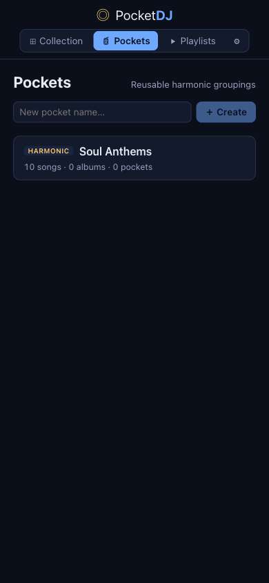
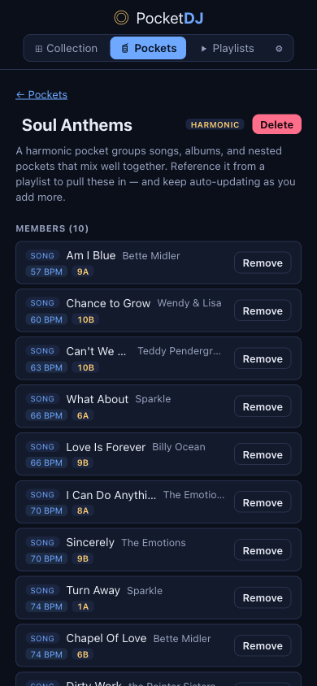
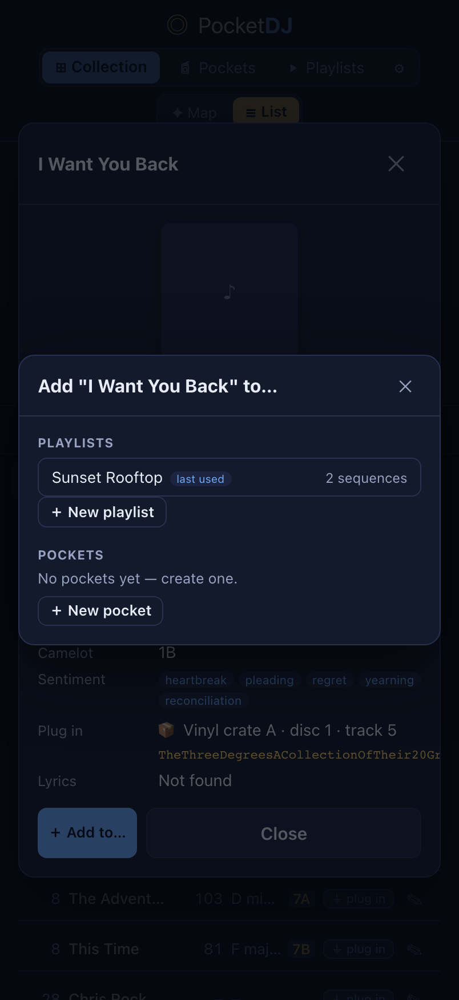
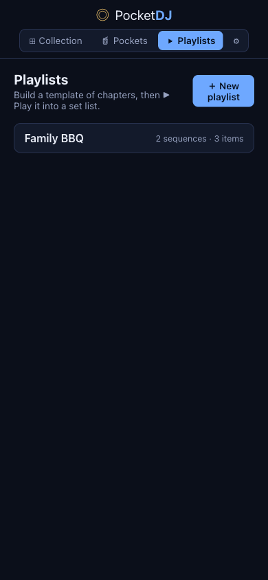
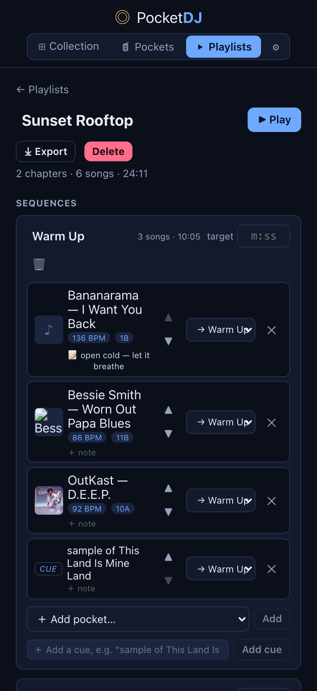
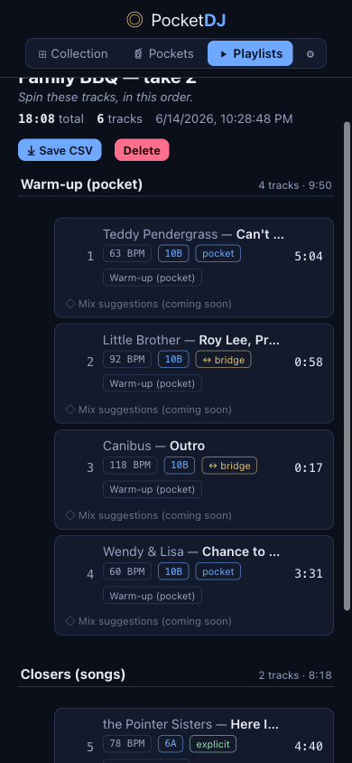
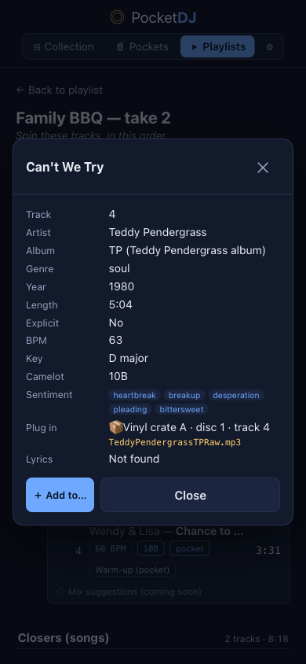

# Perform From the Crate — Pockets, Playlists & Setlists

> Part of the [PocketDJ Product Storybook](../STORYBOOK.md). The Explore chapter is
> about *finding and maintaining* the crate; this one is about **performing from it**.
> Three nouns build a set:
>
> - A **Pocket** is a reusable, harmonically-coherent grouping of songs and albums that
>   can nest other pockets (a DAG) — think *"Classic Soul Anthems."*
> - A **Playlist** is a **template**: an ordered set of **sequences** ("chapters"), each
>   holding songs, albums, or pocket references and an optional **time budget**.
> - A **Setlist** is a **frozen instance**: hitting **▶ Play** *realizes* the template
>   into a concrete, ordered track list — expanding albums, **sampling** over-budget
>   pockets to fit their slot, and **autofilling** gaps with harmonic bridge tracks —
>   then persists it so you can read it off, export it, rip it, and burn it.
>
> The systems-side complement is
> [Performance Engine](../architecture/04-performance-engine.md).

## Pockets — list

The Pockets mode landing screen: a **New pocket** creator and a list of existing
pockets, each a card with a **kind badge** (`HARMONIC`), the name, and member
counts (*songs · albums · child pockets*).

**Affordances**
- **New pocket name… + Create** — make a pocket, then jump into it.
- **A pocket card** — open its detail ([Pocket — detail](#pocket--detail)).
- The new **bag** icon marks the Pockets tab; the **▶ play** icon marks Playlists.

**User story:** "keep a few reusable crates of records that mix well together, so I
can drop a whole vibe into any set."

---

## Pocket — detail

Inside a pocket: an editable **name**, an **⤓ Export**, a **Delete**, and the
**Members** list. **Export** writes a portable `.pocket.pocketdj.zip` (the pocket plus
any nested child pockets, DAG-expanded) that any client — browser or the native apps —
can import; ids are reminted on import so it never clobbers an existing pocket. Each
song is a **two-line row** — title + artist on top, then its **BPM** and
**Camelot key** badges (e.g. `57 BPM · 9A`) so the harmonic coherence of the pocket
is visible at a glance. A **Child pockets** section nests other pockets (cycle-
guarded). Tapping a song opens the same **song detail** popover used everywhere
else ([Setlist — tap a track for song detail](#setlist--tap-a-track-for-song-detail)).

**Affordances**
- **⤓ Export** — download the pocket (with its nested pockets) as a `.pocket.pocketdj.zip`.
- **Tap a song** — open its detail popover.
- **Remove** — drop a member.
- **Add child pocket** — nest another pocket (rejected if it would create a cycle).
- Members are added from anywhere via **＋ Add to…** ([Add to a pocket or playlist](#add-to-a-pocket-or-playlist)).

**User story:** curate the crate and *see the key/tempo spread* while you do it — a
pocket is only as good as how well its records mix.

---

## Add to a pocket or playlist

The shared **＋ Add to…** picker, reachable from any song or album — the browser
song detail, the album view, and the solar-system popovers. It lists your
**Playlists** (with a sequence count) and **Pockets**, plus **＋ New playlist /
＋ New pocket** to create-and-add in one step. (Here it's layered over a song's
detail card — note *Lyrics — Not found* behind it, the lazy lyrics loader behaving
correctly when none exist.)

**Affordances**
- **A playlist row** — add the item (to a chosen sequence if it has more than one).
- **A pocket row** — add the item to that pocket.
- **＋ New playlist / ＋ New pocket** — create and add in one action.

The picker surfaces your **last-used** playlist/pocket first (with a *last used* badge) and
defaults to the sequence you last added into — fewer taps when you're building a set fast.

**User story:** wherever you find a record, you're one tap from filing it into a set
or a crate.

---

## Playlists — list

The Playlists mode landing: a **New playlist** creator and the list of playlist
**templates**, each showing its sequence and item counts.

**Affordances**
- **New playlist name… + Create** — start a template and open it.
- **A playlist card** — open its detail/editor ([Playlist — the template](#playlist--the-template-sequences)).

**User story:** "keep the sets I perform — Family BBQ, Sunday Brunch — as living
templates I can re-roll any time."

---

## Playlist — the template (sequences)

The template editor. The header has the editable **name**, the primary **▶ Play**
button, and **Delete**. Below are the **Sequences** (chapters): here *Warm-up
(pocket)* carries a **10:00 target** and holds the **Soul Anthems** pocket (10
items); *Closers (songs)* holds two hand-picked songs. Each item can be **moved**
between sequences or **removed**, and **＋ Add sequence** adds a chapter. At the
bottom, **Set lists** is the history of everything you've generated from this
template.

**Affordances**
- **▶ Play** — realize the template into a new Setlist ([Setlist — a generated performance](#setlist--a-generated-performance-the--play-payoff)) and open it.
- **target (m:ss)** — give a sequence a time budget; pockets sample to fit it.
- **Move to / Remove / ＋ Add pocket / ＋ Add sequence** — shape the chapters.
- **A set list row** — open a previously generated performance.

Each item row carries its **album cover art** and **BPM / Camelot** badges, and the header
shows a **song count + total runtime** both **per chapter** and for the **whole playlist**.
Every item can be **reordered** with **▲ / ▼** within its chapter (disabled at the ends) or
moved between chapters with the **→ chapter** dropdown; **＋ note** attaches an inline
**performer note** (*"open cold — let it breathe"*); and tapping the item's **name** opens its
full **song metadata**. You can also drop a **free-text cue** that isn't a catalog item —
*"sample of This Land Is Mine"* — straight into a chapter as a **CUE** row, and **⤓ Export**
saves the whole playlist to a portable file.

**User story:** compose the *shape* of the night — a warm-up pulled from a pocket,
a fixed pair of closers — without nailing down the exact tracks yet.

---

## Setlist — a generated performance (the ▶ Play payoff)

Hitting **▶ Play** freezes a **Setlist**: *"Family BBQ — take 2 · 18:08 total."*
Tracks are grouped under **section headers that map to the playlist's sequences**.
The *Warm-up (pocket)* section came in at **9:50 — under its 10:00 budget**: from a
44-minute, 10-song pocket the engine **sampled** a coherent subset and **autofilled
harmonic bridges** (the `↔ bridge` tracks, key-matched at `10B`) to smooth the
transitions; the *Closers* are the `explicit` hand-picks. Every row shows **BPM +
Camelot key**, a **provenance badge** (`pocket` / `↔ bridge` / `explicit`), and a
dormant **Mix suggestions** seam (coming soon). **Play again → a different take**
(the pocket samples fresh each time).

**Affordances**
- **⤓ Save CSV** — export the set via the native OS file picker (name + location).
  Columns: `#, Artist, Title, BPM, Key, Length, Source, Sequence, Song ID` — the
  **Song ID** lets a downstream process resolve each track's audio segment in O(1).
- **Delete** — discard this take.
- **Tap a track** — open its song detail ([Setlist — tap a track for song detail](#setlist--tap-a-track-for-song-detail)).

The realized set list has an **editable name**, **per-track performer notes**, and renders
any **free-text cues** as no-audio rows; the **Save CSV** export carries a **Note** column, so
your cues and notes travel to whatever you spin from.

**User story:** the mission payoff — a real, saved set list you can read off ("spin
these, in this order"), export, or regenerate for a different feel.

---

## Setlist — tap a track for song detail

Tapping any setlist track (or pocket member, or browser row) opens the shared
read-only **song detail** popover — track #, artist, album, genre, year, length,
explicit flag, **BPM / Key / Camelot**, sentiment tags, the analog **plug-in**
pointer, and lyrics — closed by a **mobile-friendly ✕** in the top-right.

**Affordances**
- **✕ (top-right) / Close / Escape / backdrop** — dismiss.
- **＋ Add to…** — file this track into a pocket or playlist ([Add to a pocket or playlist](#add-to-a-pocket-or-playlist)).

The card shows the **album cover** and an **Album → ↗** link that opens the album view, so you
can jump from a track straight to its record.

**User story:** one consistent detail card everywhere, so you can always check a
track's key/tempo before you commit it to a mix.

---

## Press Play on a playlist or pocket — hear it now, in order or shuffled

A playlist and a pocket aren't just things you *shape* — you can also **hear them straight away**.
Each playlist and pocket detail screen carries two side-by-side buttons:

- **▶ Play** — play its songs **in their listed order**, top to bottom,
- **🔀 Shuffle** — play the same songs in a **random order**.

Tap either and the app jumps you to a single reusable **"Now Playing"** set and **starts playing
at once** in the inline player, auto-advancing track to track. It's built **literally from the
songs you're looking at** — the exact list, in order (or shuffled) — not the "realized" set the
**make-a-set-list** button produces ([Make a set list — freeze a take from a playlist](#make-a-set-list--freeze-a-take-from-a-playlist)): no sampling, no harmonic autofill, no dedup. A song
that can't be resolved to anything playable is simply dropped from the run. Because it's **one
shared set** that's **reused** every time, hitting **▶ Play** or **🔀 Shuffle** anywhere just
**replaces** what's in Now Playing rather than piling up a new set each time — and it's **hidden
from your set-list history** and **cleared on launch**, so it never clutters the sets you've
deliberately saved.

Landing in **Now Playing** drops you into the normal setlist screen ([Setlist ▸ ▶ Play — play the whole set in order](play-rip-burn.md#setlist---play--play-the-whole-set-in-order)), so you can **see
what's next and reorder it on the fly** while it plays — exactly the controls you'd want with a
set running.

**User story:** "I just want to *hear* this crate right now — one tap to play it in order, one
to shuffle it — and still see and nudge what's coming up next."

---

## Make a set list — freeze a take from a playlist

**Realizing** a playlist into a frozen, saved take — expanding albums, sampling over-budget
pockets to fit, autofilling harmonic bridges ([Playlist — the template](#playlist--the-template-sequences)–[Setlist — a generated performance](#setlist--a-generated-performance-the--play-payoff)) — lives on its own toolbar button marked
with the **list.bullet.clipboard** icon. Tap it to generate a concrete, persisted **set list**
from the template; the plain **▶ Play** beside it is the play-it-now button above.

**User story:** "Keep the two ideas separate: one button just plays the crate, the other builds
me a real, saved set list I can tweak, rip, and burn."

---

## Your playlists on top; folders to organize them

**Your playlists come first.** The Playlists screen renders **your own playlists above** the
**"From your sources"** section — the sets you build are what you reach for, so they sit at the
top.

**Folders.** You can group playlists into **folders**:

- **＋ New folder** — create one and name it,
- **rename** or **delete** a folder — deleting it **keeps the playlists**; they simply fall back
  to the top level,
- **move** a playlist into (or out of) a folder.

Folders show as **collapsible sections** ordered by name, and **each section remembers whether
you left it collapsed** — so a long shelf of sets stays tidy. Folders ride along through
**import/merge** and the **backup zip**, so the way you've organized your sets travels with them
to another device.

**User story:** "I've got a lot of sets — let me file them into folders I can fold shut, and keep
the ones I made up top where I actually look."

---

## Export a tracklist — PocketDJ or CSV

Exporting a **playlist**, **pocket**, **set list**, or a **session's tracklist** asks for a **format**:

- **PocketDJ (full metadata)** — the existing re-importable bundle (`.pocketdj.zip`) that keeps
  *everything* PocketDJ knows and can be loaded straight back into the app. This is the **default**.
- **CSV (tracklist)** — a **universal** comma-separated list any spreadsheet, DJ app, or database can
  read, with just the columns **everyone** shares: **play track # · Title · Artist · Album · Year ·
  Genre**. It deliberately **leaves out** PocketDJ's own metadata (BPM/key/segments/provenance) —
  that's what the PocketDJ format is for — so the CSV stays portable.

The format picker appears after you tap **Export**; pick **PocketDJ** to keep working inside the app,
or **CSV** to hand your tracklist to the outside world. A single **playlist** or **pocket** in the
PocketDJ format is a tiny **`.playlist.pocketdj.zip`** / **`.pocket.pocketdj.zip`** that **references
the catalog by id** (the app re-seeds the same index), so it's a few KB rather than bundling hundreds
of KB of catalog and art — yet imports with every song resolved; a **portable** mode still bundles
everything for a device with a different or empty catalog, and an import lands as *"… (imported)"*
without clobbering what's already there.

**User story:** "Export a set as PocketDJ when I'm round-tripping it in the app — or as a plain CSV
with just the universal columns when I need to drop the tracklist into a spreadsheet or another DJ
tool."
